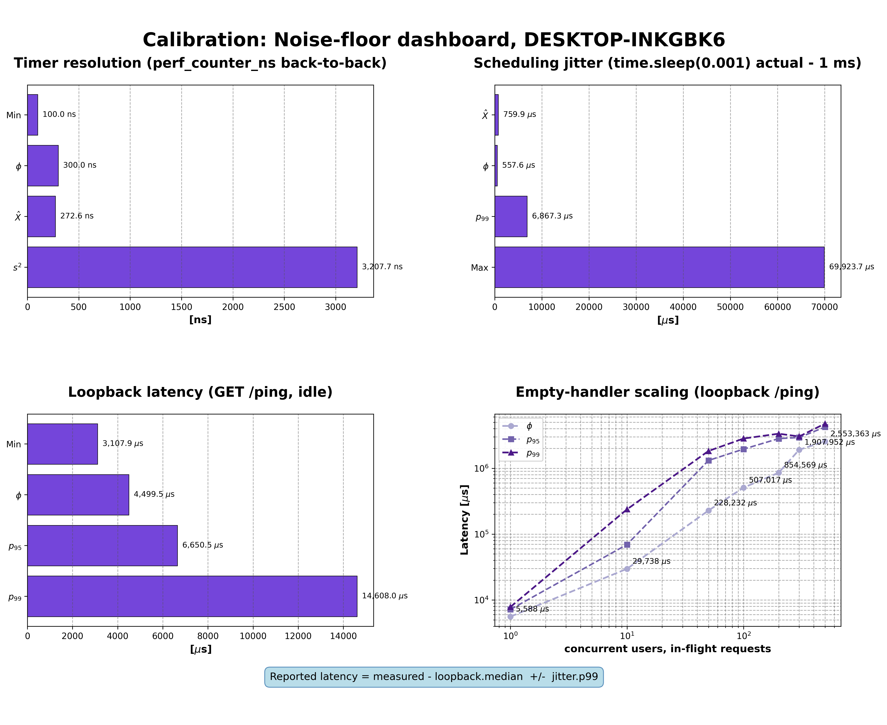
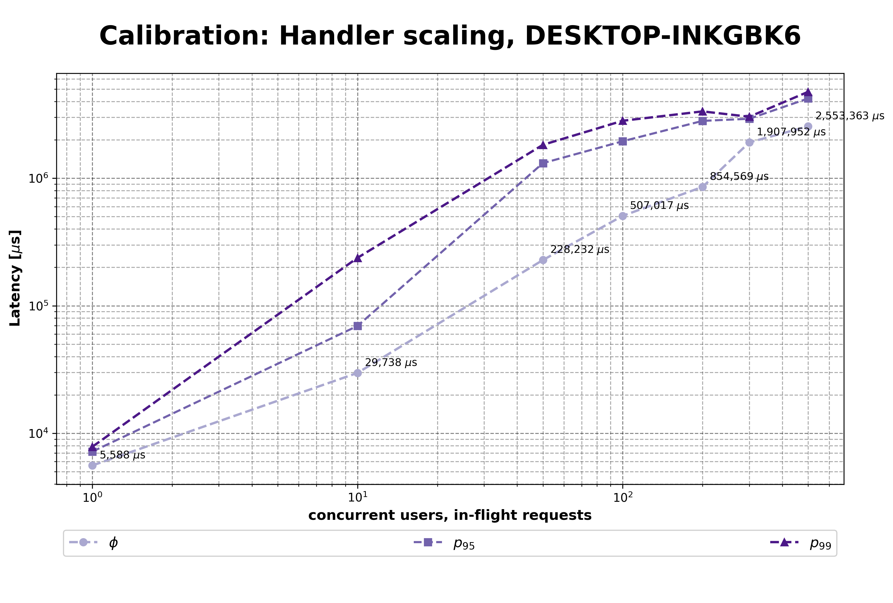

# PyDASA-CS1-TAS — Tele Assistance System Case Study

Reproducible DASA (Dimensional Analysis for Software Architecture) evaluation of the **Tele Assistance System** self-adaptive exemplar (Weyns & Calinescu, 2015). Consumes the sibling [`PyDASA`](../PyDASA) library as a pinned wheel; produces the JSON metrics and figures that ground the DASA evaluation of TAS.

## What this repo is

- **A reproducible pipeline**, not a library. The output is a matrix of metric JSONs and figures that demonstrate DASA on a published self-adaptive system.
- **One case study** — *CS-01 TAS*. The sibling IoT-SDP case study lives in its own repo.
- **Five evaluation methods** × **four adaptation states** = **20 runs**.

## Evaluation methods

| # | Method | Module | Notebook(s) | Produces |
|---|---|---|---|---|
| 1 | **analytic** | `src/methods/analytic.py` | `01-analytic.ipynb` | Closed-form QN metrics (M/M/c/K + Jackson). |
| 2 | **stochastic** | `src/methods/stochastic.py` | `02-stochastic.ipynb` | SimPy DES ground truth with 95 % CIs. |
| 3 | **dimensional** | `src/methods/dimensional.py` | `03-dimensional.ipynb` + `04-yoly.ipynb` | π-groups, derived coefficients (θ, σ, η, φ), sensitivity, design-space yoly clouds. |
| 4 | **experiment** | `src/methods/experiment.py` | `05-experiment.ipynb` | FastAPI microservice replication of the TAS topology (tech-agnostic validation of DASA predictions). |
| 5 | **comparison** | *planned* | `06-comparison.ipynb` | Cross-method deltas + R1/R2/R3 verdicts. |

Status: methods 1–4 done with tests (177 total); method 5 planned.

## Adaptation axis

| Value | Meaning | Loads |
|---|---|---|
| `baseline` | Before adaptation (MAPE-K inert) | `profile/dflt.json`, scenario `baseline` |
| `s1` | Service-failure adaptation (Retry-style) | `profile/opti.json`, scenario `s1` |
| `s2` | Response-time adaptation (Select-Reliable-style) | `profile/opti.json`, scenario `s2` |
| `aggregate` | Both S1 and S2 applied (realistic deployment) | `profile/opti.json`, scenario `aggregate` |

## Validation criteria (Cámara et al., 2023)

| Requirement | Metric | Threshold | Lens |
|---|---|---|---|
| R1 | average failure rate | ≤ 0.03 % | Availability |
| R2 | average response time | ≤ 26 ms | Performance |
| R3 | average cost | minimise subject to R1 ∧ R2 | Cost |

R1/R2/R3 are computed by `src/analytic/metrics.check_requirements` against thresholds in `data/reference/baseline.json`, and written as `data/results/<method>/<adaptation>/requirements.json` alongside each run's metrics JSON. `comparison` (method 5) aggregates verdicts across methods.

## Quick start

```bash
python -m venv venv && source venv/Scripts/activate   # Git Bash on Windows
pip install -r requirements.txt

# run one cell of the matrix
python -m src.methods.analytic --adaptation baseline

# or run the notebooks
jupyter lab
```

Full setup and the 20-run matrix in [notes/quickstart.md](notes/quickstart.md).

## Calibration (experiment method)

Before every `experiment` run, characterise the host noise floor:

```bash
python -m src.methods.calibration
```

Output lands at `data/results/experiment/calibration/<host>_<YYYYMMDD_HHMMSS>.json`. The envelope has four blocks — read them as follows.

| Block | What it measures | Read it as |
|---|---|---|
| `timer` | Back-to-back `perf_counter_ns` reads | `min_ns` is the finest tick the host can resolve. On Windows you want `< 1000 ns` after `timeBeginPeriod(1)`; `15600 ns` means the timer fix did not take. |
| `jitter` | Accuracy of `time.sleep(0.001)` | `p99_us` is the worst-case OS preemption. Any inter-arrival coarser than `p99_us` can be resolved cleanly; finer cannot. At 400 req/s inter-arrival is 2500 μs — `p99_us` should stay well below that. |
| `loopback` | RTT of `GET /ping` with zero service logic | `median_us` is the irreducible floor on this host. Any experiment latency measured below this value is an instrument error, not a real service. |
| `handler_scaling` | Loopback at `n_con_usr` (concurrent-user load) 1 / 10 / 50 / 100 / … against a single-worker `c_srv=1` service | Median / p99 at each level. Growing gap between `n_con_usr=1` and `n_con_usr=10` tells you how much the FastAPI event loop queues when in-flight requests stack up — often the real cause of degradation at high rates. |

Apply the baseline to every measured experiment latency:

```
reported = measured_us − loopback.median_us  ± jitter.p99_us
```

Subtract the loopback median (host overhead), report the jitter p99 as the uncertainty band. This is what turns a raw timing into a defensible number.

### Visual examples (this repo's reference host)

`00-calibration.ipynb` (or the CLI script) emits two figures alongside the JSON envelope, both saved as PNG + SVG under `data/img/experiment/calibration/`.

**Calibration dashboard.** Single-figure summary card for an appendix or methodology section. Top-left bars are the timer-resolution distribution; top-right is the scheduling jitter; bottom-left is the idle loopback latency; bottom-right is the empty-handler scaling line plot. The suptitle carries the host identity, timestamp, and the `reported = measured - loopback_median ± jitter_p99` formula so the figure stands on its own.



**Empty-handler scaling.** Standalone log-log line plot of median / p95 / p99 latency vs concurrency. The single figure that makes FastAPI / event-loop saturation legible: a flat-then-steep curve like the one below means the prototype's bottleneck is event-loop queueing at high in-flight counts, not the load generator or the logger.



The figures above were produced on the project's reference host (Windows 11, 16-core, 64 GB RAM, no other workloads running). Headline numbers from this baseline:

| Probe | Number | What it means |
|---|---|---|
| Timer min tick | **100 ns** | sub-microsecond clock floor; `timeBeginPeriod(1)` is effective |
| Jitter p99 | **~1.36 ms** | worst-case OS preemption; safe inter-arrivals must be coarser than this |
| Loopback median | **~1.29 ms** | irreducible HTTP-on-localhost overhead; subtract this from every measured latency |
| Loopback p99 | **~2.21 ms** | tail of the irreducible overhead |
| Handler scaling | **1.5 ms (`n_con_usr=1`) → ~30 s (`n_con_usr=10000`)** | log-log curve; the slope is the FastAPI / event-loop saturation signature |

Your machine's absolute numbers will differ but should follow the same shape. Treat any obvious deviation (timer resolution above 1 μs, loopback median above ~5 ms, handler-scaling slope shallower than two decades from `n_con_usr=1` to `n_con_usr=10000`) as a signal that something on the host is interfering and worth investigating before drawing conclusions from the experiment results.

Full plan, per-host checkpoints, and the four reference recipes live in [notes/calibration.md](notes/calibration.md).

## Repository layout

```
├── 01-analytic.ipynb  02-stochastic.ipynb  03-dimensional.ipynb  04-yoly.ipynb
├── src/
│   ├── methods/              # orchestrators (one per method) with run() + CLI
│   ├── analytic/             # closed-form QN solvers (Queue factory, Jackson)
│   ├── stochastic/           # SimPy DES engine
│   ├── dimensional/          # PyDASA adapters (schema, engine, coefficients,
│   │                         # sensitivity, reshape, sweep networks)
│   ├── view/                 # plotters (qn_diagram.py + dc_charts.py)
│   ├── io/                   # profile + method-config loaders
│   └── utils/                # shared helpers (mathx)
├── data/
│   ├── config/
│   │   ├── profile/          # dflt.json (baseline) + opti.json (s1/s2/aggregate)
│   │   └── method/           # per-method tunables (stochastic, dimensional)
│   ├── reference/            # authors' TAS 1.6 replication dump
│   ├── results/<method>/<adaptation>/<profile>.json + requirements.json
│   └── img/<method>/<adaptation>/<figure>.{png,svg}
├── tests/                    # pytest — mirrors src/ subpackages
├── notes/                    # context, objective, workflow, quickstart, commands, devlog
├── __OLD__/                  # frozen prior implementation (reference only)
├── CLAUDE.md                 # Claude Code project guide (conventions)
└── requirements.txt
```

## Naming conventions

### Notebook names

Thin notebooks at repo root use `NN-<method>.ipynb` (`01-` ... `06-`) so they sort in pipeline order in file explorers. Module names (`src/methods/<method>.py`), result folders (`data/results/<method>/`), and figure folders (`data/img/<method>/`) stay **unprefixed** — the `NN-` prefix is notebook-only.

### Config and result files

```
data/config/profile/<profile>.json      # dflt | opti
data/config/method/<method>.json        # stochastic | dimensional
data/results/<method>/<scenario>/<profile>.json + requirements.json
```

The path tells you the method and scenario; the filename tells you the profile.

### Figure file naming (plotter acronyms)

Short 2–3-letter prefixes identify the source plotter. These are used in both `data/img/<method>/<adaptation>/` deliverable figures and any throwaway `_sandbox/` dumps.

| Prefix | Plotter | Expansion |
|---|---|---|
| `topology` | `plot_qn_topology` / `plot_qn_topology_grid` | queue-network architecture |
| `nd_` | `plot_nd_heatmap` / `plot_nd_diffmap` / `plot_nd_ci` | **n**o**d**e (per-artifact) |
| `net_` | `plot_net_bars` / `plot_net_delta` | **net**work-wide |
| `ad_` | `plot_arts_distributions` | **a**rts **d**istributions (histograms) |
| `sb_` | `plot_system_behaviour` | **s**ystem **b**ehaviour (3D yoly) |
| `yc_` | `plot_yoly_chart` | **y**oly **c**hart (2D 2×2) |
| `yab_` | `plot_yoly_arts_behaviour` | **y**oly **a**rtifact **b**ehaviour (3×N 3D grid) |
| `yac_` | `plot_yoly_arts_charts` | **y**oly **a**rtifact **c**harts (3×N 2D grid) |

Also detailed in [notes/workflow.md](notes/workflow.md).

### Yoly subfolder layout

`04-yoly.ipynb` produces figures in three parallel subfolders:

```
data/img/dimensional/yoly/
├── baseline/    # before adaptation (MAPE-K inert) -- per-artifact + TAS_{1} zoom
├── aggregate/   # after adaptation (realistic deployment) -- same layout
└── cmp/         # comparison plots: baseline vs aggregate for TAS_{1}
```

Folders prefixed `_` under `data/img/` or `data/results/` are treated as **sandbox** / throwaway.

### Artifact names in configs

13-artifact TAS queueing network:

- `TAS_{1}..TAS_{6}` — TAS composite workflow stages (`TAS_{1}` = dispatch node, entry point for external arrivals)
- `MAS_{1..3}` / `MAS_{4}` — Medical Analysis Services (slot 4 is the opti upgrade for S2)
- `AS_{1..3}` / `AS_{4}` — Alarm Services (slot 4 is the opti upgrade)
- `DS_{3}` / `DS_{1}` — Drug Service (DS_{1} is the opti upgrade for aggregate)

`TAS_{1}` is ONE node of the system, not the whole architecture. The whole architecture is tagged `TAS` (no number) in the PACS-iter2 aggregation convention — see [`src.dimensional.aggregate_architecture_coefficients`](src/dimensional/reshape.py) which produces one architecture-level θ/σ/η/φ/ε by summing raw per-node variables first and dividing after.

## Dimensional-method specifics

Two complementary views:

- **`03-dimensional.ipynb`** — static: one coefficient value per artifact at the seeded operating point (runs `src.methods.dimensional.run` per adaptation, then reuses the `qn_diagram` plotters on coefficient columns).
- **`04-yoly.ipynb`** — dynamic: the design-space coefficient cloud for the WHOLE TAS architecture across a `(mu_factor, c, K, lambda)` sweep. Uses `src.dimensional.sweep_architecture` which applies `solve_jackson_lambdas(P, f · λ₀)` at every sweep point so per-node arrivals respect the routing topology. The sweep ramps the external-arrival factor from `lambda_factor_min · f_max` up to `f_max` (first-node-saturation edge, binary-searched) in `lambda_steps` increments. Output goes to `data/img/dimensional/yoly/{baseline,aggregate,cmp}/` as `yc_arch` (2D yoly) + `sb_arch` (3D) + the three per-node grids (`ad_per_node`, `yab_per_node`, `yac_per_node`).

Configuration sweep grid lives in `data/config/method/dimensional.json::sweep_grid`:

```json
{
  "mu_factor":     [0.5, 0.8, 1.0, 1.5, 2.0, 4.0],
  "c":             [1, 2, 3, 4],
  "K":             [8, 10, 16, 32],
  "lambda_steps":  30,
  "lambda_factor_min": 0.05,
  "util_threshold": 0.95
}
```

For each `(mu, c, K)` combo, λ is ramped from `λ_factor_min · λ_max` to `λ_max = util_threshold · μ · c` in `lambda_steps` increments, generating a trace (curve) through coefficient space — not a single dot.

### Three aggregation modes

| Function | Aggregates what | Output |
|---|---|---|
| [`coefficients_to_network(result, agg="mean")`](src/dimensional/reshape.py) | per-node θ/σ/η/φ (compute first, average after) | single-row mean of pre-computed per-node coefficients |
| [`aggregate_architecture_coefficients(result, tag="TAS")`](src/dimensional/reshape.py) | raw setpoint variables (sum L / Σλ / Σμ, divide after) | single architecture-level coefficient set `θ_TAS, σ_TAS, η_TAS, φ_TAS, ε_TAS` — matches PACS iter2 static pattern |
| [`aggregate_sweep_to_arch(sweep_data, tag="TAS")`](src/dimensional/reshape.py) | the same PACS-iter2 aggregation but applied **point-by-point** across the yoly sweep | arrays of architecture-level θ/σ/η/φ across every feasible sweep point, ready for `plot_yoly_chart` / `plot_system_behaviour` |

### Yoly sweep helpers

| Function | What it does | When to use |
|---|---|---|
| [`sweep_artifact(key, vars_block, sweep_grid)`](src/dimensional/networks.py) | single-node M/M/c/K sweep; independent of topology | debugging one node's design space |
| [`sweep_artifacts(cfg, sweep_grid)`](src/dimensional/networks.py) | loop `sweep_artifact` over every node; each at its seeded λ, no propagation | per-node introspection; NOT the architecture view |
| [`sweep_architecture(cfg, sweep_grid)`](src/dimensional/networks.py) | whole-network Jackson-propagated sweep; every point is a network-wide solve | architecture-level yoly; `04-yoly.ipynb` uses this |

## Documentation map

- **[notes/quickstart.md](notes/quickstart.md)** — setup and how to run the pipeline
- **[notes/workflow.md](notes/workflow.md)** — full method contracts + figure-naming table (audit surface)
- **[notes/context.md](notes/context.md)** — the case study's full record (architecture, scenarios, ADRs)
- **[notes/objective.md](notes/objective.md)** — case-study narrative
- **[notes/commands.md](notes/commands.md)** — command cheatsheet
- **[notes/devlog.md](notes/devlog.md)** — dated design decisions and pivots
- **[CLAUDE.md](CLAUDE.md)** — coding and notebook conventions for the Claude Code agent

## PyDASA dependency

`requirements.txt` pins a specific PyDASA wheel. After bumping PyDASA:

```bash
cd ../PyDASA && python -m build
pip install --force-reinstall ../PyDASA/dist/pydasa-<ver>-py3-none-any.whl
```

Do NOT edit PyDASA code from this repo. Bugs or missing features → open an issue/PR against `../PyDASA/`.

## Tests

```bash
pytest tests/ -v             # full suite (analytic + stochastic + dimensional + io + methods)
pytest tests/dimensional/    # just the dimensional engine tests
```

Current count: **177 tests** passing. Full run ~3 min on baseline hardware.

## License

See [LICENSE](LICENSE).
