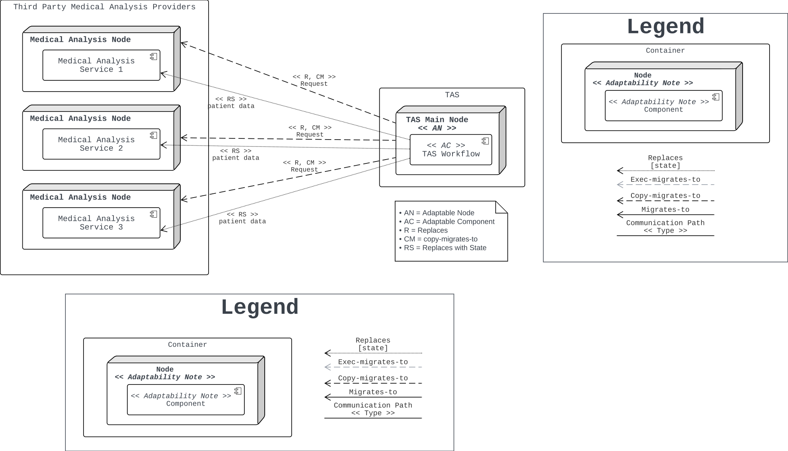
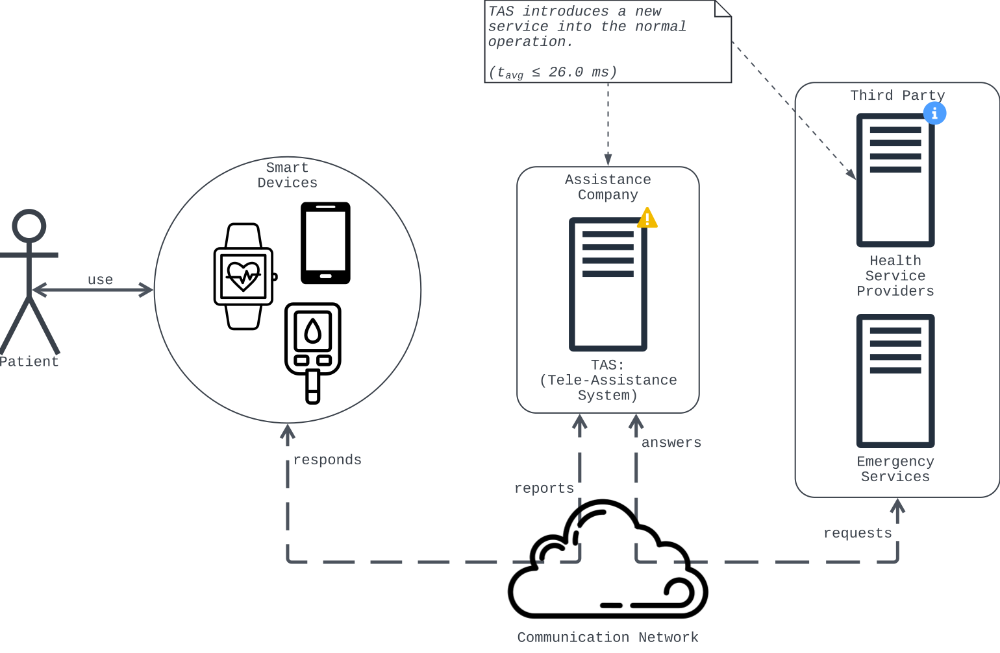
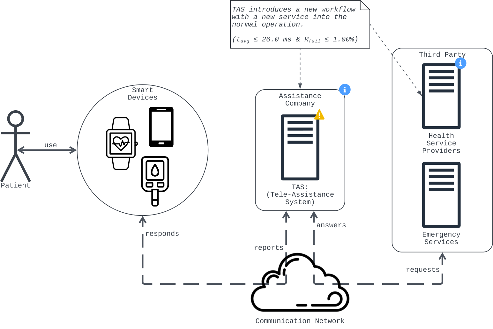
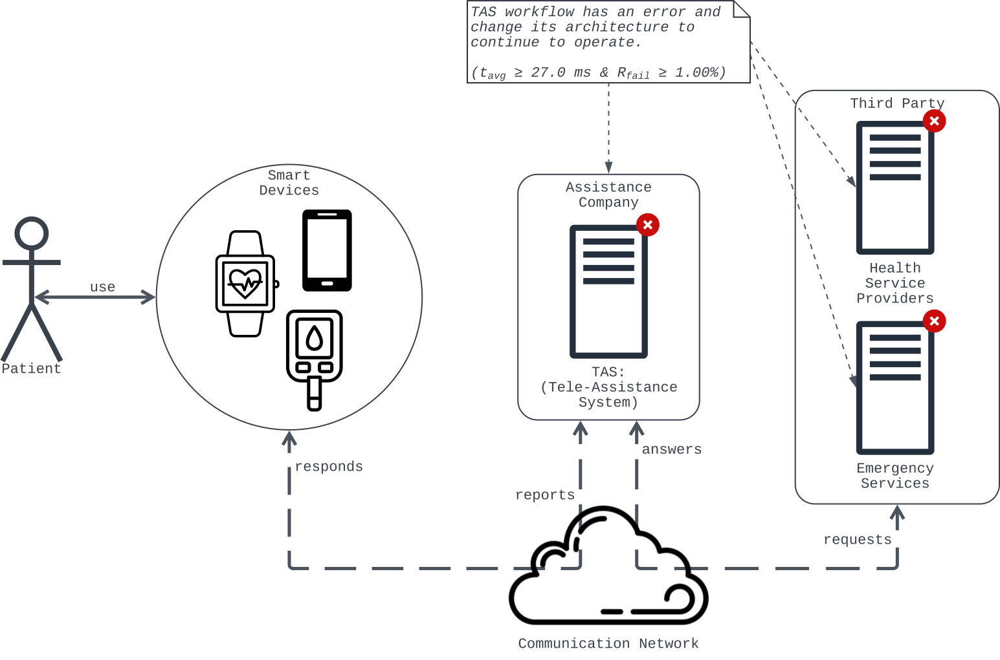

# Case Study — CS-1 Tele Assistance System (TAS)

Source documents: `assets/docs/CS/N1/` (Weyns and Calinescu 2015; Iftikhar and Weyns 2014, 2017; Weyns and Iftikhar 2016; Cámara et al. 2023; MATI presentation 2023).
Methodology: `assets/md/tgt/02/methodology.md` (Architectural Case Study template, Table 4).
Style skill: `.claude/skills/write/arch-case-study.md`.
Status: src notes for the dissertation. The companion *Smart City IoT Service Discovery Platform* (*IoT-SDP*) case is documented in the sibling `PyDASA-CS2-IoT-SDP` repo.

---

## Introduction

**CS-1: Tele Assistance System (TAS).** A composite service that orchestrates three atomic services (*Drug*, *Medical Analysis*, *Alarm*) for home care of patients with chronic conditions, with *diabetes* as the canonical clinical example. Runs on the *ReSeP* platform and uses *ActivFORMS* as the adaptation engine. TAS has been a reference exemplar in the *SEAMS* community since 2015 and has evolved across three source papers (Weyns and Calinescu 2015, Weyns and Iftikhar 2016, Cámara et al. 2023), giving a rich, decade-long baseline to anchor comparisons against.

### Selection rationale

This work fixes the trade-off lens to ***Performance vs. Availability*** and uses *TAS* as one of two validation cases *"where conflicting workload requirements naturally highlight Performance and Availability trade-offs"*. *TAS* is framed by its authors as a *Reliability* vs. *Cost* exemplar; we re-read its four-metric QA catalogue (failure rate, response time, cost, throughput) under the *Performance vs. Availability* lens without rewriting the source numbers. It offers the richest QoS structure in the self-adaptive literature and cleanly separates the managed from the managing subsystem, which makes it the canonical reference for tactics-to-scenarios comparison.

The SFAM research proposal frames *SAS*-literature weaknesses the case helps expose:

1. Lack of rigorous evaluation methods.
2. Insufficient focus on alternative quality attributes beyond *Performance*.
3. Limited trade-off management across multiple QAs.
4. Limited design-decision transparency.
5. Limited guidance on how reported results are achieved.

*TAS* discharges items 1-5 directly: explicit numeric targets (failure rate ≤ 0.03 %, response time ≤ 26 ms), a documented *Reliability* vs. *Cost* trade-off with two effector strategies, and a clean MAPE-K split that makes design-decision provenance traceable. The companion CS-2 *IoT-SDP* case adds proactive adaptation and resource-constrained-edge coverage and is documented in the sibling repo.

---

## CS-1: Tele Assistance System (TAS)

| Field              | Value                                                                                                                                                                                                                                        |
| ------------------ | -------------------------------------------------------------------------------------------------------------------------------------------------------------------------------------------------------------------------------------------- |
| Case identifier    | `CS-1` (legacy `N1-TAS`)                                                                                                                                                                                                                 |
| Case name          | Tele Assistance System (*TAS*)                                                                                                                                                                                                             |
| Domain             | Healthcare (chronic-disease home care), Service-Based Systems (*SBS*), Self-Adaptive Systems (*SAS*)                                                                                                                                     |
| Primary source     | Weyns and Calinescu (2015) [1]                                                                                                                                                                                                               |
| Supporting sources | Iftikhar and Weyns (2014, 2017) [2], [3]; Weyns and Iftikhar (2016) [13]; Cámara, Wohlrab, Garlan, and Schmerl (2023) [10]; Arteaga Martin and Correal Torres,*Introducción a la Autoadaptabilidad*, MATI class presentation (2023) [11] |
| Runtime platform   | *ReSeP* (Research Service Platform) [1]                                                                                                                                                                                                    |
| Adaptation engine  | *ActivFORMS* (Active Formal Models) [2], [3]                                                                                                                                                                                               |
| ACS designation    | Descriptive with Explanatory extension (per Runeson and Höst [4])                                                                                                                                                                           |

*TAS* is a reference implementation of a service-based self-adaptive application for remote health monitoring. Weyns and Calinescu introduced *TAS* in 2015 [1] as an exemplar for the self-adaptive systems research community, filling a well-documented gap: the absence of shared, reproducible prototypes that allow researchers to compare adaptation approaches on equal footing. The exemplar standardises three things: a common service workflow, five generic adaptation scenarios drawn from the service-based self-adaptation literature, and four Quality Attribute (*QA*) measurement metrics that let different research teams produce directly comparable figures on the same baseline.

The clinical intent of *TAS* is to provide home care for patients with chronic conditions. The canonical example used in the author's own teaching material [11] is **diabetes**: the system periodically reviews vital signs such as glucose level, analyses the measurements externally, changes the prescribed drug or the dose when the analysis indicates it, and notifies emergency services when circumstances warrant or the patient presses a panic button. The **primary functional requirements** are therefore (i) periodic vital-parameter sampling, (ii) external analysis of the measurement stream, (iii) drug-change or dose-change actions when analysis dictates, and (iv) alarm-triggering when the button is pressed or the analysis returns a *sendAlarm* verdict. The **primary QA trade-off** in the authors' own vocabulary is *Reliability* vs. *Cost*: the exemplar's adaptation strategies (`Retry`, `Select Reliable`) raise *Reliability* at the price of invocation cost and response time, and neither strategy dominates the other (see *Headline Results* below). This work does not stay within that vocabulary; following the *Performance vs. Availability* lens we re-read the same metrics as *Performance* (average response time) and *Availability* (average failure rate, equivalent to the authors' *Reliability* signal), with *Cost* retained as a secondary trade-off driver and *Functionality* retained as a compliance attribute from [1] Table II. The **adaptation objectives** as framed by Cámara et al. [10] are three quality requirements, which we re-label under our lens without changing their numeric content: `R1` keep the average failure rate below `0.03 %` (the authors call this a *Reliability* target; we read it as *Availability*); `R2` keep the average response time below `26 ms` (*Performance*); `R3` subject to `R1` and `R2`, minimise cost. The earlier [13] framing uses different numeric targets and inverts the `R3` objective (see *Technical Specifications* below).


Figure CS1.1. *TAS* context diagram.

### Source of information

The table below names each source consulted, what it contributes, when it was published, where it is filed, and who produced it. Per `ADR-CS1-06` (below), [1] Weyns and Calinescu 2015 is the authoritative source; everything else is supporting.

| **What (content)**                                                                                                                                                   | **When** | **Where**                                            | **Who**                                 |
| -------------------------------------------------------------------------------------------------------------------------------------------------------------------------- | -------------- | ---------------------------------------------------------- | --------------------------------------------- |
| Original*TAS* architecture, five-scenario catalogue, Table IV summary results of Retry vs. Select Reliable baseline                                                      | 2015           | `Weyns and Calinescu - 2015.pdf`, SEAMS 2015 proceedings | D. Weyns, R. Calinescu                        |
| *ActivFORMS* engine formalisation on a robotics example (Turtlebot), not TAS-specific                                                                                    | 2014           | `Iftikhar and Weyns - 2014.pdf`, SEAMS 2014 proceedings  | M. U. Iftikhar, D. Weyns                      |
| *ActivFORMS* runtime environment with DeltaIoT example, not TAS-specific                                                                                                 | 2017           | `Iftikhar and Weyns - 2017.pdf`, ICSAW 2017 proceedings  | M. U. Iftikhar, D. Weyns                      |
| Mid-generation TAS complement: stochastic user model, 15-service catalogue, service-time decomposition, early R1/R2/R3 framing, UPPAAL STA models                          | 2016           | `Weyns and Iftikhar - 2016.pdf`, ICAC 2016 proceedings   | D. Weyns, M. U. Iftikhar                      |
| Second-generation analytical revision: 9-service catalogue with response-time column, R1/R2/R3 with numeric targets, PCA/DTL design-space analysis, TAS V1 and V2 variants | 2023           | `Cámara et al. - 2023.pdf`, JSS vol. 198                | J. Cámara, R. Wohlrab, D. Garlan, B. Schmerl |
| Teaching consolidation: bounded-system diagram,`SAS-001`/`SAS-002` labels, 5W+1H on S1 and S2, numeric targets summary                                                 | 2023           | `MATI - SFAM - Intro Archi SAS-v2.0.pdf`                 | S. F. Arteaga Martin, D. E. Correal Torres    |

### Architectural Reconstruction

The reconstruction is divided into two architectural concerns per the self-adaptive-systems convention: the **Target System** (managed subsystem, the *TAS* composite service and its atomic services running on *ReSeP*) and the **Controller** (managing subsystem, the *MAPE-K* feedback loop realised by *ActivFORMS*).

#### Target System

**Logical Architecture: the TAS Workflow.** From Figure 1 of [1], the composite *TAS* service executes the following workflow in response to messages from a patient's wearable device:

```
loop:
    pick task (pickTask)
    if task = vitalParamsMsg:
        MedicalAnalysisService.analyseData(data)
        if result = changeDrug:   DrugService.changeDrug(patientId)
        else if result = changeDoses: DrugService.changeDose(patientId)
        else if result = sendAlarm:   AlarmService.sendAlarm(patientId)
    else if task = buttonMsg:
        AlarmService.triggerAlarm(patientId)
```

The workflow exhibits three decision points that create non-trivial failure-propagation paths: the `analyseData` outcome branches into three operation classes (`changeDrug`, `changeDose`, `sendAlarm`), and the panic-button path bypasses the analysis step entirely to invoke `triggerAlarm` directly.


Figure CS1.2. *TAS* workflow, reconstructed from Figure 1 of [1].

**Stochastic workflow parameterisation (Weyns and Iftikhar 2016).** The original [1] paper leaves the user-action probabilities implicit. Weyns and Iftikhar [13] later publish a stochastic model of the *TAS* environment that fills this gap. Each time tick the user either triggers a vital-parameters sample with probability `p_ANALYSIS` or presses the panic button with probability `p_EMERGENCY = 1 - p_ANALYSIS`. A typical evaluation setting in [13] uses `p_EMERGENCY = 0.25` (one-quarter of ticks are emergency calls). After the *Medical Analysis Service* returns its result, approximately `66 %` of the non-`patientOK` outcomes route to the *Drug Service* (`changeDrug` or `changeDose`) and approximately `34 %` route to the *Alarm Service* (`sendAlarm`). These probabilities drive the stochastic-timed-automaton simulations used to estimate expected failure rate, cost, and service time at runtime.

**Runtime Architecture: ReSeP components on the managed side.** *ReSeP* reifies the *SOA* principles [1]. The classes below (reproduced from Figures 2 and 3 of [1]) constitute the managed subsystem, i.e., the part of the platform that the *MAPE-K* controller acts upon:

| **Class**        | **Role in the managed subsystem**                                                                              |
| ---------------------- | -------------------------------------------------------------------------------------------------------------------- |
| `AbstractService`    | Root of the service hierarchy; exposes `serviceName`, `startService()`, `stopService()`, `invokeOperation()` |
| `AtomicService`      | Individual operation providers (*DrugService*, *MedicalAnalysisService*, *AlarmService*)                       |
| `CompositeService`   | Orchestrating services (*TAS* itself); executes a workflow over atomic services                                    |
| `ServiceRegistry`    | Lookup and registration of services and their `ServiceDescription` entries                                         |
| `ServiceDescription` | Service metadata: id, endpoint,`operationList`, `customProperties` (QoS)                                         |
| `ServiceCache`       | Local cache of available services per client;`refresh()` on demand                                                 |
| `WorkflowEngine`     | Executes the workflow specification for a composite service                                                          |
| `ServiceClient`      | Invokes composite services with QoS requirements                                                                     |
| `InputProfile`       | Scripted sequence of invocations with predefined QoS requirements                                                    |


Figure CS1.3. *ReSeP* service structure realising the *TAS* composite service, reconstructed from Figures 2 and 3 of [1].

**Services, Profiles, and Costs.** The original 7-service catalogue from Table III of [1]:

| **Service**              | **Failure rate** | **Cost per invocation** |
| ------------------------------ | :--------------------: | :---------------------------: |
| `Alarm Service 1`            |          0.11          |             4.87             |
| `Alarm Service 2`            |          0.04          |             9.74             |
| `Alarm Service 3`            |          0.18          |             2.65             |
| `Medical Analysis Service 1` |          0.12          |             4.43             |
| `Medical Analysis Service 2` |          0.07          |             7.84             |
| `Medical Analysis Service 3` |          0.18          |             2.78             |
| `Drug Service 1`             |          0.06          |             10.00             |

*Cost per invocation* values are expressed in the nominal units of the *TAS* exemplar; [1] does not state an explicit currency. The cost-reliability inversion is deliberate: cheaper alternatives such as *Alarm Service 3* at 2.65 per invocation have higher failure rates (0.18), so the adaptation engine is forced to arbitrate between *Cost* and *Reliability* rather than pick a dominant service.

**Intermediate profile and service-time decomposition (Weyns and Iftikhar 2016).** The mid-generation revision [13] introduces a **fifteen-service catalogue** (five concrete instances per service type: `5 AS + 5 MAS + 5 DS`), each characterised by a failure rate and a cost, plus per-service **queue length** and **response time** measured at runtime (Table II of [13]). The same paper defines **service time** as the sum of two components:

```
Service Time = Response Time + Waiting Time in Queue
```

This decomposition is what makes the `R3'` in [13] target `serviceTime` rather than `response time` in isolation: a configuration can satisfy `R1` and `R2` and still have a high service time if pending invocations accumulate in the queue. The 2016 profile sits between [1]'s seven-service catalogue and [10]'s nine-service catalogue with a response-time column, and pre-dates [10] by seven years. The ACS does not reproduce [13] Table I verbatim because the published table has partial cells that are hard to transcribe precisely from the PDF.

**Alternative service profile (Cámara et al. 2023).** Second-generation revision with nine services from Table 1a of [10]:

| **Id** | **Service name** | **Fail rate [%]** | **Resp time [ms]** | **Cost [usd]** |
| :----------: | ---------------------- | :---------------------: | :----------------------: | :------------------: |
|    `S1`    | Medical S.1            |          0.06          |            22            |         9.8         |
|    `S2`    | Medical S.2            |           0.1           |            27            |         8.9         |
|    `S3`    | Medical S.3            |          0.15          |            31            |         9.3         |
|    `S4`    | Medical S.4            |          0.25          |            29            |         7.3         |
|    `S5`    | Medical S.5            |          0.05          |            20            |         11.9         |
|   `AS1`   | Alarm S.1              |           0.3           |            11            |         4.1         |
|   `AS2`   | Alarm S.2              |           0.4           |            9            |         2.5         |
|   `AS3`   | Alarm S.3              |          0.08          |            3            |         6.8         |
|    `D1`    | Drug S.1               |          0.12          |            1            |         0.1         |

Alongside the services, [10] introduces two **architectural design parameters** that [1] treats implicitly: `MAX_TIMEOUTS`, the maximum number of retries on a failed service call before giving up; and `timeout length`, the waiting period per attempt before a timeout is declared. These drive the design space reduced via PCA and Decision Tree Learning in [10]. Two variants *TAS V1* and *TAS V2* are studied separately. From Figures 6 and 8 of [10], the variants differ in the decision-tree splits: *V1* uses `MAX_TIMEOUTS < 2` at the root and `AS3$0 = exists` as the dominant secondary split, yielding a top-reliability leaf (`1.00`) when both conditions apply. *V2* keeps the same root but elevates `AS1`, `AS2`, and `AS3` to joint influence, with leaves in the `0.89` to `0.99` range. The practical difference is the scope of which alarm services are architecturally significant.

When a later analysis cites *TAS* service parameters, it should state whether it uses the 2015, 2016, or 2023 profile, and if 2023, which variant (*V1* or *V2*), to avoid silent mixing of the four options.

#### Controller

**Managing-subsystem components.** The *MAPE-K* feedback loop in *ReSeP* is realised through two hook classes that the managed subsystem exposes and two profile classes that parameterise experiments:

| **Class**                     | **Role in the managing subsystem**                                                                   |
| ----------------------------------- | ---------------------------------------------------------------------------------------------------------- |
| `Probe` / `WorkflowProbe`       | Senses workflow events (`workflowInvocationStarted`, `workflowInvocationCompleted`, `serviceFailed`) |
| `Effector` / `WorkflowEffector` | Manipulates workflow state (`removeFailedService`, `setPreferredService`, `changeQoSRequirement`)    |
| `ServiceProfile`                  | Hooks `preInvokeOperation` and `postInvokeOperation` to inject failure, delay, or cost behaviour       |
| `InputProfile`                    | Scripted sequence of invocations with predefined QoS requirements                                          |

The *ReSeP* effector set directly enables the five adaptation scenarios of Table I. Specifically, `removeFailedService` combined with `setPreferredService` implements `S1`; `setPreferredService` over response-time-annotated alternatives implements `S2`; `changeQoSRequirement` drives `S3`. Scenarios `S4` (new goal, change workflow architecture) and `S5` (wrong operation sequence, change workflow architecture) require runtime rewriting of the workflow itself and therefore **fall outside the published effector set**. [1] implies full scenario coverage but does not document a workflow-rewriting effector; a follow-up extension would need to add one (for example, a `WorkflowEditor` effector operating on the `WorkflowEngine`).



Figure CS1.4. *TAS* adaptability overview: *MAPE-K* feedback loop over the managed subsystem.

**Adaptation engine: ActivFORMS.** Iftikhar and Weyns developed *ActivFORMS* as a runtime environment for architecture-based adaptation with formal guarantees [2], [3]. The defining property that *ActivFORMS* brings to *TAS* is that the *MAPE-K* feedback loop is specified as a UPPAAL timed-automata model, verified at design time, and then directly executed at runtime rather than translated into code. The guarantees established by the model checker therefore carry over to execution without the usual code-generation gap.

**UPPAAL stochastic-timed-automata models (Weyns and Iftikhar 2016).** Where [1] summarises *ActivFORMS* at a high level, [13] publishes the full set of stochastic-timed-automata (STA) models used at runtime, distributed across five diagrams:

- `Figure 4`, **Environment model**: encodes the stochastic user behaviour (`p_ANALYSIS` vs. `p_EMERGENCY` tick, post-analysis `66 % / 34 %` branch).
- `Figure 5`, **Managed System model**: the *TAS* workflow as an STA, starting with `assignServices(AS, MAS, DS)` and tracking invocations via the `serviced?` signal.
- `Figure 6`, **Quality model: failure rate**: STA computing average failure rate from the concrete service failure rates along the executed path.
- `Figure 7`, **Quality model: cost**: STA computing average per-invocation cost in the same way.
- `Figure 11`, **Quality model: service time**: STA computing average service time as the sum of response time and waiting time in queue along the executed path (introduced when the third quality is added).

The full UPPAAL source is referenced by the project website cited in [13] but not reproduced in the paper. For the purposes of this ACS, the five figures document the adaptation behaviour completely.

**Adaptation strategies evaluated on TAS.** Two *ActivFORMS* strategies are compared in [1]:

- **Retry.** On failure, the effector selects an alternative service from the cache and retries the operation. The retry count is bounded.
- **Select Reliable.** On failure, an equivalent service is invoked in parallel to the primary. Each operation is attempted once; at least one success is sufficient.

**Tactics identified (Bass 3rd edition).** Mapping the *ReSeP* components and the two adaptation strategies to the Bass et al. tactic catalogue [6] yields the correspondence below. The mapping is interpretive and relies on the terminology verified in `.claude/skills/design/bass3-qa-tradeoff-analysis.md`; it does not introduce tactics outside that catalogue.

| **Bass tactic category (3rd ed.)**            | **Tactic**                     | **Realisation in TAS**                                                                                                                                                                                                |
| --------------------------------------------------- | ------------------------------------ | --------------------------------------------------------------------------------------------------------------------------------------------------------------------------------------------------------------------------- |
| *Availability*: Fault Detection                   | Ping/Echo, Heartbeat, Exception      | `WorkflowProbe.serviceFailed` detects failed invocations; `postInvokeOperation` raises exceptions on service-profile-triggered failures                                                                                 |
| *Availability*: Recovery (Preparation and Repair) | Active Redundancy                    | *Select Reliable* strategy: equivalent service invoked in parallel with the primary, consistent with the 3rd-edition definition of *Active Redundancy* (hot restart) where all redundant components respond in parallel |
| *Availability*: Prevention                        | Removal from Service                 | `WorkflowEffector.removeFailedService` withdraws an unreliable service from the client's cache                                                                                                                            |
| *Modifiability*: Defer Binding                    | Runtime Registration, Dynamic Lookup | `ServiceRegistry` and `ServiceCache` allow runtime discovery and replacement of services                                                                                                                                |
| *Performance*: Resource Management                | Maintain Multiple Copies             | Multiple equivalent atomic services (*Alarm 1/2/3*, *Medical 1/2/3*) reduce contention and raise reliability                                                                                                            |
| *Performance*: Resource Demand                    | Control Frequency of Sampling        | `InputProfile` throttles the invocation rate of the composite service                                                                                                                                                     |

The *Retry* strategy of [1] does not map to a single 3rd-edition tactic. It is realised as a composition of tactics already listed above: `Exception` detection via `WorkflowProbe.serviceFailed`, `Removal from Service` via `WorkflowEffector.removeFailedService`, and `Dynamic Lookup` through the `ServiceCache` to locate an alternative. Bass 4th edition introduces `Retry` as a named tactic under *Recover from Faults*, *Preparation and Repair*, but this work stays with the 3rd edition [6] and describes the strategy as a composition rather than renaming it.

**Self-\* properties exercised by TAS.** Mapping the exemplar onto the IBM autonomic computing taxonomy [11], *TAS* exercises four self-* properties. *Self-Healing* is realised by discovering failures in external services through `WorkflowProbe.serviceFailed` and replacing them through `WorkflowEffector.setPreferredService`. *Self-Optimization* is realised by the `Planner`'s utility function that trades off service response time, failure rate, and invocation cost. *Self-Awareness* is realised by the probes that continuously monitor the quality attributes listed in the *Technical Specifications* section below, across both the [1] Table II definition (four attributes, six metrics) and the [10] revision that drops *Functionality* and adds an explicit *Service response time* metric under *Performance*. *Context-Awareness* is realised by the `ServiceCache` that tracks the metrics of external service providers so the adaptation decisions depend on the current state of the environment.

### Design Notes

Following Wohlin [8], we log the principal decisions that shape how this case study is framed.

**ADR-CS1-01: Adopt TAS as the first case study.**

- **Context.** This work requires case studies on realistic self-adaptive architectures. Candidates were *TAS* (service-based), *DeltaIoT* (*IoT* / multi-hop communication, see [3]), and *EUREMA* (model-driven self-adaptation). *TAS* offers the richest QoS structure, the cleanest separation between managed and managing subsystems, and a broad adoption base that supports analytical generalisation.
- **Decision.** *TAS* is adopted as CS-1.
- **Consequences.** CS-2 focuses on a system with different structural features (federated *IoT* service discovery) to broaden analytical generalisation per Rico [9].

**ADR-CS1-02: Focus on scenarios S1 and S2 for analytical work.**

- **Context.** *TAS* defines five adaptation scenarios. `S4` and `S5` require workflow restructuring that changes the architecture itself.
- **Decision.** The initial reconstruction targets `S1` (service failure) and `S2` (response-time variability) for analytical work. Scenarios `S3` to `S5` are logged as extensions in the reconstruction but do not drive quantitative analysis.
- **Consequences.** Analytical focus limited to the static *ReSeP* topology.

**ADR-CS1-03: Use ActivFORMS published results as the comparison baseline.**

- **Context.** To compare any new analysis or adaptation approach against *TAS*, a baseline of observed outcomes is needed.
- **Decision.** We adopt the three outcomes from Table IV of [1] (*No Adaptation*, *Retry*, *Select Reliable*) as the baseline, with [13] Section V-B as the extended-sample-size complement. Any future analysis is validated against both.
- **Consequences.** This work does not re-run the original *TAS* experiments; it re-interprets the published results. Any discrepancy between a new analysis and the published baseline becomes a research finding in its own right.

**ADR-CS1-04: Stateless atomic services.**

- **Context.** The *TAS* exemplar uses stateless atomic services for the idempotent-operation assumption. Real clinical systems have stateful drug-history records.
- **Decision.** This work preserves the statelessness assumption to keep *Select Reliable* semantics interpretable.
- **Consequences.** Stateful extensions are out of scope. A future case study could introduce a transactional atomic service to exercise additional *Availability* tactics such as `Transactions`.

**ADR-CS1-05: Two architectural abstraction levels.**

- **Context.** The *TAS* architecture has at least two meaningful abstraction levels: composite-to-atomic (the *CompositeService* calling *AtomicService* through the *WorkflowEngine*) and atomic-to-atomic peer-level substitution (during adaptation).
- **Decision.** The reconstruction documents both levels as separate views.
- **Consequences.** Any subsequent analysis (tactics mapping, QA evaluation, or methodology-specific follow-up) can select either view as its scope without conflating them.

**ADR-CS1-06: Source hierarchy and inconsistency policy.**

- **Context.** The CS-1 source set spans five *TAS*-specific documents that do not fully agree: the original journal paper [1], the two *ActivFORMS* papers [2], [3] (which describe the adaptation engine using **non-TAS** examples: a *Turtlebot* warehouse in [2] and *DeltaIoT* in [3]), the mid-generation complement [13] (which expands to a 15-service catalogue, adds stochastic user probabilities, and introduces the service-time decomposition), the second-generation analytical revision [10] that adds a richer nine-service catalogue, two variants, and three named quality requirements, and the author's own teaching consolidation [11]. The disagreements are often subtle (new naming, new columns, new parameters, inverted optimisation objectives) rather than outright contradictions.
- **Decision.** [1] Weyns and Calinescu 2015 is the **authoritative source** for the *TAS* architecture, scenarios, and original experimental numbers. [2] and [3] describe the *ActivFORMS* engine and are cited only for engine semantics; they do not update *TAS*-specific results because they use other illustrative cases. [13] Weyns and Iftikhar 2016 is a **mid-generation complement** that fills gaps in [1]: the stochastic user model, the fifteen-service catalogue, the service-time decomposition, and an earlier `R1/R2/R3` framing. [10] Cámara et al. 2023 is a **second-generation analytical revision** with a nine-service catalogue, two variants, and revised `R1/R2/R3` targets. Where [13] and [10] disagree, the ACS quotes both framings and names them explicitly. [11] is treated as a teaching consolidation: its numeric additions are adopted; any internal inconsistencies of [11] defer to [1] Table II.
- **Consequences.** Any new analysis that cites *TAS* must state which source set it uses. The evolution of the *TAS* exemplar from [1] (2015) through [13] (2016) to [10] (2023) is itself a finding: the *TAS* case study is a living artefact that the same research community has revised over roughly a decade.

**Resolved decisions (P1-P5).**

- **P1 resolved (longer runs).** Weyns and Iftikhar [13] Section V-B publish a `10 000`-invocation experiment with a `1 000`-invocation moving window and two accuracy settings (`RSEM = 5 %`, `RSEM = 10 %`).
- **P2 resolved (random seed).** Not stated in [1], [10], or [13]. Closed as unresolvable from current sources.
- **P3 resolved (full UPPAAL model).** [13] Figures 4, 5, 6, 7, and 11 publish the full STA model set.
- **P4 resolved (S3-S5 via ReSeP effectors).** Only `S1`, `S2`, `S3` supported by the published effector set; `S4` and `S5` require a workflow-rewriting effector that [1] does not document.
- **P5 resolved (V1 vs V2 differences).** *V1* uses `AS3` as dominant secondary split; *V2* elevates `AS1`, `AS2`, `AS3` to joint significance. Both share the nine-service catalogue and `R1`-`R3` requirements.

**Inconsistencies noted across source documents.** Per `ADR-CS1-06`, [1] is authoritative. The table below logs every systematic disagreement between [1], [13], and [10] (with [11] cited where relevant). The *ActivFORMS* papers [2], [3] do not appear because they use non-*TAS* illustrative examples.

| **#** | **Aspect**                    | **[1] 2015**                                                        | **[13] 2016**                                                                                                  | **[10] 2023** (and [11] where relevant)                                                                      | **Resolution**                                                          |
| :---------: | ----------------------------------- | ------------------------------------------------------------------------- | -------------------------------------------------------------------------------------------------------------------- | ------------------------------------------------------------------------------------------------------------------ | ----------------------------------------------------------------------------- |
|      1      | Service count                       | Seven services (3 Alarm + 3 Medical Analysis + 1 Drug)                    | Fifteen services (5 AS + 5 MAS + 5 DS)                                                                               | Nine services (3 Alarm + 5 Medical + 1 Drug)                                                                       | All three preserved.                                                          |
|      2      | Service naming                      | `Alarm Service 1`, `Medical Analysis Service 1`, `Drug Service 1`   | `AS`, `MAS`, `DS` abbreviations with numbered instances                                                        | `(AS1) Alarm S.1`, `(S1) Medical S.1`, `(D1) Drug S.1`                                                       | Each table uses the source's own naming.                                      |
|      3      | Failure-rate unit                   | Decimal, not stated                                                       | `F_rate` column, no `%`                                                                                          | `Fail rate (%)` explicit                                                                                         | [10] disambiguates.                                                           |
|      4      | Cost unit                           | Unlabelled                                                                | Unlabelled                                                                                                           | `Cost (usd)`                                                                                                     | [10] confirms USD.                                                            |
|      5      | Response time and service time      | Absent                                                                    | Response time and queue length per service (Table II); service-time decomposition `= Response Time + Waiting Time` | Added column `Resp time (ms.)`                                                                                   | Each paper adds a different level of detail.                                  |
|      6      | Quality framing                     | Four QAs with six metrics (Reliability, Performance, Cost, Functionality) | Three requirements `R1/R2/R3` cost-centred                                                                         | Three requirements `R1/R2/R3` response-time-centred                                                              | All three views preserved.                                                    |
|      7      | Numeric targets                     | Not stated                                                                | `R1: 0.15 × 10⁻³` failureRate, `R2: 8 × 10⁻³` averageCost                                                  | `R1: 0.03 %`, `R2: 26 ms`, `R3: minimise cost s.t. R1, R2`                                                   | Both target sets attributed to their source;**not interchangeable**.    |
|      8      | `R3` objective                    | Not defined                                                               | Minimise `failureRate` (or `serviceTime` in [13] Section V-C)                                                    | Minimise `cost`                                                                                                  | Objective**inverts** between [13] and [10].                             |
|      9      | Architectural design parameters     | Implicit                                                                  | Implicit                                                                                                             | `MAX_TIMEOUTS` and `timeout length` named explicitly                                                           | [10] names these.                                                             |
|     10     | Number of versions                  | One                                                                       | One setting                                                                                                          | `TAS V1` and `TAS V2` studied separately                                                                       | [10] publishes both.                                                          |
|     11     | Workflow user model                 | Not stated                                                                | `p_ANALYSIS`, `p_EMERGENCY = 1 - p_ANALYSIS`, `25 %` emergency, `66 % / 34 %` drug/alarm split               | Not re-stated                                                                                                      | [13] fills the gap.                                                           |
|     12     | Metric count claim in [11] slide 31 | Not applicable                                                            | Not applicable                                                                                                       | Slide 31 says `4 atributos con 7 métricas (3 y 5 en el reporte)` which is internally inconsistent with slide 20 | [1] Table II wins.                                                            |
|     13     | Scenario IDs                        | `S1`-`S5` in [1] Table I                                              | Narrative names                                                                                                      | Narrative names                                                                                                    | `S1`-`S5` is primary; `SAS-001`, `SAS-002` from [11] are shorthands.  |
|     14     | Scenario coverage in experiment     | Table IV:`No Adaptation`, `Retry`, `Select Reliable` on `S1`      | Simulation results for failure-rate and cost targets                                                                 | Analytical method, not per-scenario outcomes                                                                       | [1] Table IV is the authoritative baseline; [13] adds more statistical power. |

### Technical Specifications

**Case type.** Following Runeson and Höst [4], CS-1 is treated as a **descriptive case study with explanatory extension**. The descriptive part documents the architecture, platform, scenarios, and QA profile. The explanatory extension addresses causal claims about how *Retry* and *Select Reliable* affect reliability and cost under identical input profiles.

**Research questions.**

- **RQ-CS1.1:** What is the architectural structure of *TAS*, including its components, connectors, workflow, and runtime platform?
- **RQ-CS1.2:** How does *TAS* realise self-adaptation, and what is the separation between the managed subsystem and the managing subsystem through probes and effectors?
- **RQ-CS1.3:** How do the two adaptation strategies (*Retry* and *Select Reliable*) compare on the four quality attributes defined in [1] (Reliability, Performance, Cost, Functionality) and the three requirements in [10] (`R1`, `R2`, `R3`)?
- **RQ-CS1.4:** Which architectural tactics from the Bass 3rd-edition catalogue [6] can be identified in the *TAS* design, and how are they realised through the *ReSeP* components?

**Quality attributes under study.** Reproducing Table II of [1]:

| **Attribute** | **Metric as defined by TAS**                                                                                                                       |
| ------------------- | -------------------------------------------------------------------------------------------------------------------------------------------------------- |
| *Reliability*     | Number of failed service invocations; Number of specific operation sequence failures; Mean time to recovery                                              |
| *Performance*     | Number of specific operation sequences exceeding allowed execution time. Cámara et al. [10] add*Service response time* as a direct performance metric |
| *Cost*            | Cumulative service invocation cost over given time period                                                                                                |
| *Functionality*   | Number of faulty process executions                                                                                                                      |

**Quantitative targets (Cámara et al. 2023).** The *TAS* exemplar as revisited in [10] Table 1b reframes the quality story as three named quality requirements rather than a four-attribute metric catalogue:

| **Id** | **Description (verbatim from [10] Table 1b)**        |
| :----------: | ---------------------------------------------------------- |
|    `R1`    | The average failure rate should not exceed `0.03%`       |
|    `R2`    | The average response time should not exceed `26 ms`      |
|    `R3`    | Subject to `R1` and `R2`, the cost should be minimised |

`R3` is a **conditional optimisation**: cost minimisation is only meaningful when `R1` and `R2` are simultaneously satisfied. The per-scenario thresholds that trigger adaptation at runtime are `Rfail ≥ 0.03 %` for the service-failure scenario and `tavg ≥ 27.0 ms` for the response-time-variability scenario [11].

**Earlier requirement framing (Weyns and Iftikhar 2016).** Seven years before [10], Weyns and Iftikhar [13] expressed the adaptation goals with different thresholds and a different optimisation objective:

|               **Id**               | **[13] 2016 framing**                                      | **[10] 2023 framing**                               |
| :---------------------------------------: | ---------------------------------------------------------------- | --------------------------------------------------------- |
|                  `R1`                  | `failureRate ≤ 0.15 × 10⁻³`                                | `failure rate ≤ 0.03 %`                                |
|                  `R2`                  | `averageCost ≤ 8 × 10⁻³`                                   | `response time ≤ 26 ms`                                |
|                  `R3`                  | Subject to `R1` and `R2`, **minimise `failureRate`** | Subject to `R1` and `R2`, **minimise `cost`** |
| `R3'` (three-quality extension in [13]) | Minimise `serviceTime`                                         | (not defined in [10])                                     |

The `R2` dimension changes from cost to response time, and the `R3` objective inverts. Any comparison of adaptation strategies must declare which framing it uses.

**Adaptation scenarios (Table I of [1]):**

| **ID** | **Uncertainty**                                         | **Adaptation type**                                                                           | **Target requirements**                 |
| :----------: | ------------------------------------------------------------- | --------------------------------------------------------------------------------------------------- | --------------------------------------------- |
|    `S1`    | Unpredictable environment: service failure                    | Switch to equivalent service; simultaneous invocation of several services for idempotent operations | *Reliability*, *Cost*                     |
|    `S2`    | Unpredictable environment: variation of service response time | Switch to equivalent service; simultaneous invocation                                               | *Performance*, *Cost*                     |
|    `S3`    | Incomplete information: new service discovered                | Use the new service                                                                                 | *Reliability*, *Performance*, *Cost*    |
|    `S4`    | Changing requirements: new goal                               | Change workflow architecture; select new service                                                    | *Functional*: new operation                 |
|    `S5`    | Inadequate design: wrong operation sequence                   | Change workflow architecture                                                                        | *Functional*: operation sequence compliance |


Figure CS1.5-a. Scenario `S1`: service failure.


Figure CS1.5-b. Scenario `S2`: response-time variability.



Figure CS1.5-c. Scenario `S3`: discovery of a new service.



Figure CS1.5-d. Scenario `S4`: changing requirements, new goal.



Figure CS1.5-e. Scenario `S5`: inadequate design, wrong operation sequence.

**5W + 1H classification (Krupitzer et al. 2015).** Rows for `S1` and `S2` follow MATI slide 50 verbatim; rows for `S3`, `S4`, `S5` are extended by this ACS and should be read as interpretive.

| **Dimension** | **S1 · Service Failure**                                                                         | **S2 · Response-time Variability**                              | **S3 · New Service Discovered**                              | **S4 · New Goal**                                                     | **S5 · Wrong Operation Sequence**                                 |
| ------------------- | ------------------------------------------------------------------------------------------------------- | ---------------------------------------------------------------------- | ------------------------------------------------------------------- | ---------------------------------------------------------------------------- | ------------------------------------------------------------------------ |
| **When**      | Reactive                                                                                                | Reactive                                                               | Reactive                                                            | Reactive                                                                     | Reactive                                                                 |
| **Why**       | Context change, environmental uncertainty (failed invocation)                                           | Context change, environmental uncertainty (response-time drift)        | Technical-resources change (new service registered)                 | User-caused change (new business goal from stakeholders)                     | User-caused change (design correction after observing wrong sequence)    |
| **Where**     | Application level, equivalent-service substitution                                                      | Application level, equivalent-service substitution                     | Application level, service set expansion                            | Application level, workflow architecture                                     | Application level, workflow architecture                                 |
| **What**      | Structural adaptation: invoke several services for the idempotent operation or switch to equivalent     | Structural adaptation: invoke several services or switch to equivalent | Structural adaptation: include the new service in the workflow      | Structural adaptation: change workflow architecture and select a new service | Structural adaptation: change workflow architecture                      |
| **Who**       | *MAPE-K* Controller                                                                                   | *MAPE-K* Controller                                                  | *MAPE-K* Controller                                               | *MAPE-K* Controller (possibly human-in-the-loop for goal revision)         | *MAPE-K* Controller (possibly human-in-the-loop for design correction) |
| **How**       | External centralised control with utility function optimising*Reliability*, *Performance*, *Cost* | External centralised control with utility function                     | External centralised control with dynamic discovery and re-planning | External centralised control with workflow-level re-planning                 | External centralised control with workflow-level re-planning             |

**Headline results.** Summary of the six-step experiment, reproduced from Table IV of [1]:

| **Strategy**  | **Failure rate** | **Sequence failure rate** | **Cost** | **Invocations** |
| ------------------- | :--------------------: | :-----------------------------: | :------------: | :-------------------: |
| *No Adaptation*   |          0.18          |              0.22              |     8.12 K     |         1 561         |
| *Retry*           |          0.11          |              0.13              |     9.95 K     |         1 981         |
| *Select Reliable* |          0.00          |              0.00              |    11.04 K    |         1 984         |

*Select Reliable* eliminates failures entirely at roughly `36 %` higher cost than *No Adaptation*. *Retry* halves the failure rate at roughly `22 %` higher cost. Neither strategy dominates; the choice depends on the stakeholder's *Reliability*-versus-*Cost* utility function.

Only scenario `S1` is quantified in Table IV of [1]. Scenarios `S2` to `S5` are defined in Table I but not exercised in the published six-step experiment. Weyns and Iftikhar [13] Section V report a more substantial experimental setup for the same `S1`-style scenario: `10 000` invocations per experiment, `1 000`-invocation moving window, boxplots for `RSEM = 5 %` and `RSEM = 10 %`. The `RSEM = 5 %` setting roughly doubles the adaptation time of the `RSEM = 10 %` setting, which is the source-documented accuracy-versus-latency trade-off of the simulation approach.

### Insights and Limitations

**Lessons learned (analytical generalisability per Rico [9] and Runeson-Höst [4]).**

- **L1.** The explicit separation of **managed** subsystem (*CompositeService*, *AtomicService* instances, *WorkflowEngine*) from **managing** subsystem (probes, effectors, *MAPE-K* loop) is the central architectural decision that makes *TAS* reusable as an exemplar.
- **L2.** Service profiles (`preInvokeOperation` / `postInvokeOperation`) are a clean mechanism for injecting failure, delay, and cost behaviour without modifying service implementations.
- **L3.** Input profiles decouple the stimulus pattern from the system under test, which is the key reason third parties can replicate *TAS* experiments exactly.
- **L4.** *Retry* and *Select Reliable* represent a classic *Reliability*-*Cost* trade-off: *Retry* is cheaper but less reliable; *Select Reliable* is most reliable but most expensive.
- **L5.** *Select Reliable* achieves perfect reliability only when the simultaneous invocation is truly independent, which *ReSeP* guarantees for stateless idempotent operations. For stateful operations *Select Reliable* would need a compensation or voting tactic.
- **L6.** *ActivFORMS* offers formal guarantees at runtime because the UPPAAL model is executed directly, not code-generated. This is a distinct architectural stance from code-generated controllers.
- **L7.** The published **input profile** as a separable artefact lets third parties replicate the exact stimulus pattern used to generate published metrics.
- **L8.** The service-profile table (Table III of [1] or Table 1a of [10]) with explicit failure rates and costs is the single most useful artefact for anyone comparing a new adaptation approach against published baselines.

**Validity threats (Runeson-Höst dimensions, archival reconstruction reading).**

*Construct validity: are we describing TAS for what it really is?*

- **Inherited threat.** The *Reliability* metric counts raw failed invocations; a single sequence failure may involve several atomic-service failures. **Mitigation:** *Headline Results* tabulates both rates.
- **Threat to our reconstruction.** The Bass tactic mapping is our interpretation. **Mitigation:** only tactics verbatim from [6].
- **Residual risk.** The *Cost* metric uses nominal per-invocation prices from the exemplar, not real pricing.

*Internal validity: do the causal claims actually hold?*

- **Inherited threat.** [1] experiments use slightly different invocation counts (`1 981` vs. `1 984`). **Mitigation:** per-invocation normalisation preserves ordering.
- **Inherited threat.** Each strategy ran once over 500 messages in [1]. A zero-failure rate over 500 samples is not the same as zero failure probability. **Consequence:** perfect reliability claims should be read as "no failure observed in a 500-message run". [13] Section V-B extends this to 10 000 invocations.
- **Threat to our reconstruction.** We infer causal stories from [1] without re-running; any reporting error in [1] is inherited.

*External validity: how far can conclusions transfer?*

- **In scope.** Service-based self-adaptive systems with a composite workflow, replaceable atomic services with quantified QoS, and a *MAPE-K* loop over the workflow engine.
- **Out of scope.** Event-driven, data-intensive, or safety-critical systems where atomic operations are stateful.
- **Simplification threat.** *TAS* uses a simplified patient model. A real clinical deployment would face correlated event bursts and regulatory constraints.

*Reliability: can someone else produce the same reconstruction?*

- **Supports replication.** All source code, workflow XML files, service profiles, input profiles, and UPPAAL models are publicly available from the self-adaptive exemplars website.
- **Threat to exact replication.** The service-profile generator is stochastic but the paper does not state the random-number seed.
- **Threat to our reconstruction.** The tactic mapping and the two-abstraction-level decomposition are our interpretive choices. **Mitigation:** exposed in the ADRs above.

### References

[1] D. Weyns and R. Calinescu, "Tele Assistance: A Self-Adaptive Service-Based System Exemplar," in *Proceedings of the 10th International Symposium on Software Engineering for Adaptive and Self-Managing Systems (SEAMS 2015)*, Florence, Italy, May 2015, pp. 88-92. doi: 10.1109/SEAMS.2015.27.

[2] M. U. Iftikhar and D. Weyns, "ActivFORMS: Active Formal Models for Self-Adaptation," in *Proceedings of the 9th International Symposium on Software Engineering for Adaptive and Self-Managing Systems (SEAMS 2014)*, Hyderabad, India, Jun. 2014, pp. 125-134. doi: 10.1145/2593929.2593944.

[3] M. U. Iftikhar and D. Weyns, "ActivFORMS: A Runtime Environment for Architecture-Based Adaptation with Guarantees," in *Proceedings of the 2017 IEEE International Conference on Software Architecture Workshops (ICSAW)*, Gothenburg, Sweden, Apr. 2017, pp. 278-281. doi: 10.1109/ICSAW.2017.21.

[4] P. Runeson and M. Höst, "Guidelines for conducting and reporting case study research in software engineering," *Empirical Software Engineering*, vol. 14, no. 2, pp. 131-164, Apr. 2009. doi: 10.1007/s10664-008-9102-8.

[5] H. V. Coombs, "Case Study Research Defined [White paper]," Sep. 2022. doi: 10.5281/zenodo.7604301.

[6] L. Bass, P. Clements, and R. Kazman, *Software Architecture in Practice*, 3rd ed. Addison-Wesley Professional, 2012.

[7] C. B. Seaman, "Qualitative methods in empirical studies of software engineering," *IEEE Transactions on Software Engineering*, vol. 25, no. 4, pp. 557-572, Jul. 1999. doi: 10.1109/32.799955.

[8] C. Wohlin, "Case Study Research in Software Engineering: It is a Case, and it is a Study, but is it a Case Study?," *Information and Software Technology*, vol. 133, p. 106514, May 2021. doi: 10.1016/j.infsof.2021.106514.

[9] S. Rico, "Insights Towards Better Case Study Reporting in Software Engineering," in *Proceedings of the 1st IEEE/ACM International Workshop on Methodological Issues with Empirical Studies in Software Engineering (WSESE '24)*, Lisbon, Portugal, Aug. 2024, pp. 76-79. doi: 10.1145/3643664.3648208.

[10] J. Cámara, R. Wohlrab, D. Garlan, and B. Schmerl, "ExTrA: Explaining architectural design tradeoff spaces via dimensionality reduction," *Journal of Systems and Software*, vol. 198, p. 111578, Apr. 2023. doi: 10.1016/j.jss.2022.111578.

[11] S. F. Arteaga Martin and D. E. Correal Torres, *Introducción a la Autoadaptabilidad*, MATI class presentation (DISC, Universidad de los Andes, Arquitecturas de Nueva Generación), Bogotá, Colombia, 2023.

[12] C. Krupitzer, F. M. Roth, S. VanSyckel, G. Schiele, and C. Becker, "A survey on engineering approaches for self-adaptive systems," *Pervasive and Mobile Computing*, vol. 17, pp. 184-206, Dec. 2015. doi: 10.1016/j.pmcj.2014.09.009.

[13] D. Weyns and M. U. Iftikhar, "Model-based Simulation at Runtime for Self-adaptive Systems," in *2016 IEEE International Conference on Autonomic Computing (ICAC)*, Würzburg, Germany, Jul. 2016, pp. 364-373. doi: 10.1109/ICAC.2016.67.

