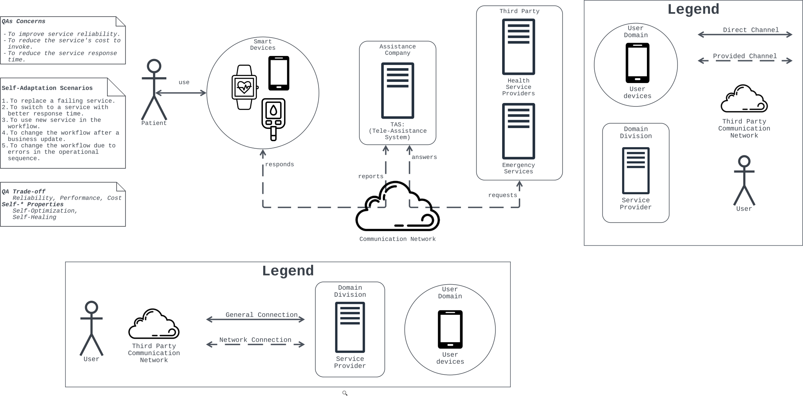
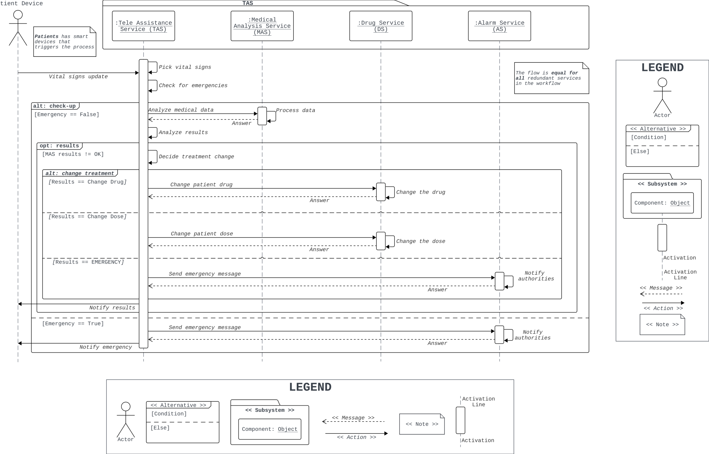
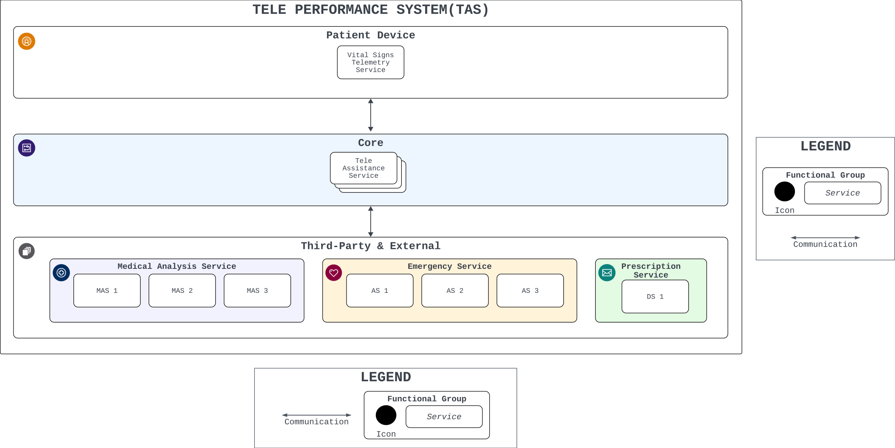
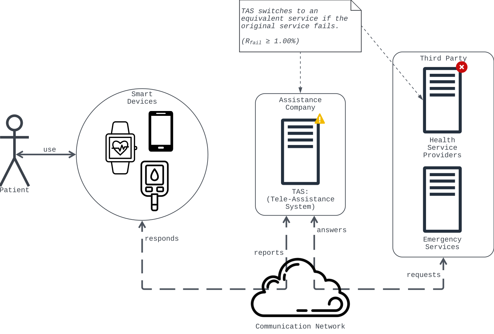
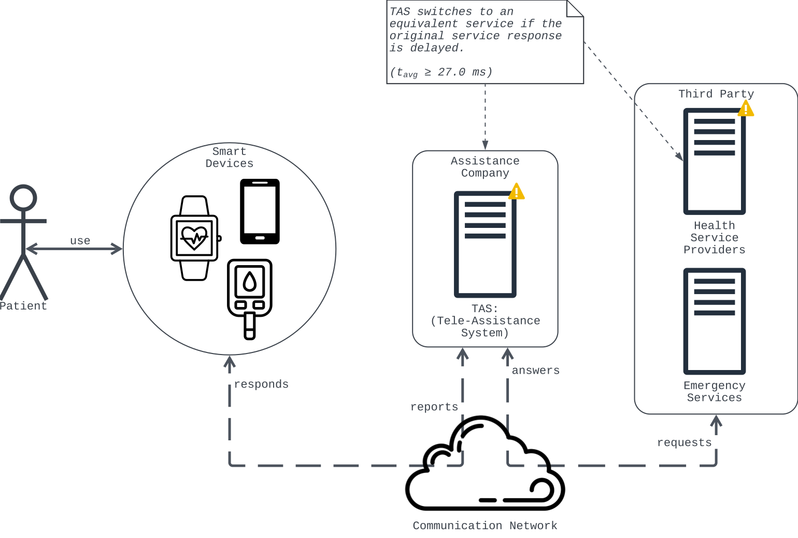

# Case Study — CS-1 Tele Assistance System (TAS)

This repo evaluates *DASA* against the *Tele Assistance System* (*TAS*) — a service-based self-adaptive application for chronic-care home monitoring with a centralised *MAPE-K* loop over its composite service. *TAS* is published, architecturally complete, and comes with the original authors' *QA* claims, which gives external evidence beyond the PACS illustrative example.

The case section follows the *Architectural Case Study* (*ACS*) template, which groups content into four methodological sections: the Summary captures case identification and the bounded system; the **Technical Specifications** state the case type and research questions; the **Architectural Reconstruction** documents data-collection methods through component, scenario, and deployment views; and the *Limits*, *Insights*, and *Design Notes* cover validity threats, generalisability claims, and architectural design records.

The case carries a specification summary (Summary + Technical Specifications), a focused architectural reconstruction, and a short findings paragraph (Limits + Insights + Design Notes). The full reconstruction and the *DASA* evaluation of *TAS* are produced by the pipeline in this repo. The companion *Smart City IoT Service Discovery Platform* (*IoT-SDP*) case is evaluated in the sibling `PyDASA-CS2-IoT-SDP` repo.

## Tele-Assistance System (TAS)

Weyns and Calinescu introduced the *Tele Assistance System* (*TAS*) in 2015 [1] as a reference exemplar for the *SAS* research community. *TAS* is a service-based self-adaptive application for chronic-disease home care, with diabetes as its canonical clinical example [2]. Two later revisions (Weyns and Iftikhar 2016 [13], Cámara et al. 2023 [10]) use different service-profile catalogues, and we cite the source paper alongside any service-specific number.

Functionally, *TAS* samples vital parameters, analyses them externally, changes the drug or dose when the analysis warrants it, and triggers an alarm either on an emergency verdict or directly through a panic-button path that bypasses the analysis. Weyns and Calinescu define five adaptation scenarios (*S1*-*S5*). *S1* (service failure) and *S2* (response-time variability) are the most thoroughly documented; only *S1* carries quantified results, in the primary paper's Table IV. The published effector set covers *S1*-*S3*; *S4* (new goal) and *S5* (wrong operation sequence) would need a workflow-rewriting effector that the paper does not document. We therefore centre the architectural reconstruction on *S1* and *S2* (the scenarios with quantified targets and published effectors) and treat *S3*-*S5* as out of scope here.

Weyns and Calinescu frame four *QAs* (*Reliability*, *Performance*, *Cost*, *Functionality*) with the primary trade-off between *Reliability* and *Cost* [1]. *Retry* and *Select Reliable* are adaptation strategies driven by the *ActivFORMS* (Active Formal Models) engine and realised as multi-step plans over one or more Bass et al. tactics. *Retry* halves the failure rate at roughly 22.0 \% higher cost than no adaptation; *Select Reliable* eliminates observed failures (in the authors' own wording, *entirely*) at roughly 36.0 \% higher cost; neither dominates. Under the *Performance vs Availability* lens, we read *Reliability* as *Availability*.

### Specification Summary

**Table 7.1: *TAS* specification summary.**[^cs1-flags]

| Attribute| Description|
| ------------------------- | --------------------------------------------------------------------------------------------------------------------------------------------------------------------------------------------------------- |
| Case identifier| `CS-1`|
| Case name| *Tele Assistance System* (*TAS*) ✓|
| Domain| - Healthcare, chronic-disease home care ✓. - Service-Based Systems (*SBS*) ✓. - Self-Adaptive Systems (*SAS*) ✓.|
| Primary source| Weyns and Calinescu (2015) [1] ✓|
| Supporting sources| - Iftikhar and Weyns (2014, 2017) [2], [3] ✓. - Weyns and Iftikhar (2016) [13] ✓. - Cámara et al. (2023) [10] ✓.|
| Runtime platform| *ReSeP* (Research Service Platform) ✓|
| Adaptation engine| *ActivFORMS* (Active Formal Models) ✓|
| ACS designation| Descriptive with Explanatory extension (Runeson and Höst) ○|
| QA goals| -*R1:* failure rate ≤ 0.03 \% (*Reliability*) ✓. - *R2:* response time ≤ 26 ms (*Performance*) ✓. - *R3:* minimise cost subject to *R1* and *R2* (*Cost*) ✓. - *Functionality* ✓. |
| Architectural constraints | - Service-oriented architecture on*ReSeP* ✓. - Stateless atomic services (idempotent operations) ✓. - *ActivFORMS* adaptation with verified *UPPAAL* stochastic-timed-automata (STA) models ✓.|
| Variation points| -`MAX_TIMEOUTS` ✓. - `timeout length` ✓. - Service-catalogue size ○. - Adaptation-strategy selection ○.|
| Adaptation Scenarios| -*S1* service failure ✓. - *S2* response-time variability ✓. - *S3* new service discovered ✓. - *S4* new goal ✓. - *S5* wrong operation sequence ✓.|

Two of the variation points in Table 7.1 are our own reading rather than explicit labels. `service-catalogue size` is inferred from the fact that the catalogue expands from seven services in [1] to fifteen in [13] and nine in [10], which implies size is a tunable dimension even though none of the sources labels it as such. `adaptation-strategy selection` is the design-time choice between *Retry* and *Select Reliable*; the two strategies are named in [1] but the act of picking one over the other is not called out as a variation point.

### Architectural Reconstruction

The Target System is the *TAS* composite service, which orchestrates three atomic services (*Drug*, *Medical Analysis*, *Alarm*) for a patient's wearable device (Figure 7.1). The composite runs on the *ReSeP* (Research Service Platform), a research implementation of service-oriented principles; the Controller is a *MAPE-K* loop realised by *ActivFORMS* around the composite.

Figure 7.1. *TAS* context diagram.

The composite follows an analyse-and-act pattern at runtime (Figure 7.2). Each vital-parameters message goes to the *Medical Analysis Service*, which returns one of three verdicts that branch to `changeDrug`, `changeDose`, or `sendAlarm` against the *Drug* or *Alarm* service. A panic-button press skips the analysis and calls `triggerAlarm` on the *Alarm* service directly. Three decision points therefore open non-trivial failure paths, and the *MAPE-K* loop must cover all of them.

Figure 7.2. *TAS* workflow.

Five principal classes structure the managed subsystem (Figure 7.3): `CompositeService` orchestrates the workflow; `AtomicService` holds the concrete *Drug*, *Medical Analysis*, and *Alarm* instances; `ServiceRegistry` and `ServiceCache` handle runtime lookup and client-side caching; `WorkflowEngine` runs the composite's workflow specification. The decision variables for the Controller sit on each concrete atomic service: its `ServiceDescription` exposes a failure-rate and a cost-per-invocation attribute, and those attributes drive every adaptation choice.

Figure 7.3. *ReSeP* service structure realising the *TAS* composite service.

Two adaptation strategies ride on the Controller's feedback loop. *Retry* composes *Exception* (fault detection), *Removal from Service*, and *Dynamic Lookup*; *Select Reliable* is *Active Redundancy*, with equivalent services invoked in parallel and one success sufficient. The Controller itself observes the workflow through `WorkflowProbe` (emitting `serviceFailed` and other events) and actuates through `WorkflowEffector` (`removeFailedService`, `setPreferredService`, `changeQoSRequirement`); its loop is specified as formal models, verified at design time, and executed directly at runtime without code generation. Both strategies rely on stateless atomic services so that parallel or retried invocations remain safe.

Figure 7.4 renders the two focus scenarios in the authors' own notation. *S1* (Figure 7.4a) fires when an atomic-service invocation returns a failure verdict: the Controller flags the failing service as unavailable, and the workflow falls back to an equivalent one resolved through `ServiceRegistry`. *S2* (Figure 7.4b) fires when the moving-average response time crosses the per-scenario threshold: the Controller updates the preferred-service ranking so that subsequent invocations route to a faster equivalent. Neither scenario rewrites the workflow, which is why they stay within the published effector set.

Figure 7.4. *TAS* adaptation scenarios: (a) *S1* service failure and (b) *S2* response-time variability.

Four items are out of scope for this reconstruction: the remaining scenarios *S3* (new service discovered), *S4* (new goal), and *S5* (wrong operation sequence); the full tactic catalogue; the managed/managing-class split; and the formal-model set.

### Findings

Weyns and Calinescu's own analysis already exposes the central tension: *Retry* and *Select Reliable* both raise *Reliability* but neither dominates on *Cost*, and *R3* is posed as a conditional optimisation, with cost minimised only when the *R1* reliability bound and the *R2* response-time bound hold simultaneously. Under the *Performance vs Availability* lens, *R1* is an *Availability* constraint and *R2* a *Performance* constraint, so *R3* becomes a cost-minimisation surface bounded by two *QA* floors rather than a scalar objective. What [1] does not do is quantify how close the operating point sits to either bound, nor report how much additional *Cost* each percentage point of *Reliability* buys; those are the questions the DASA evaluation takes up.

[^cs1-flags]: Flags in the *Description* column mark each fact as ✓ stated in the case-study documents or ○ inferred by us from those documents.
